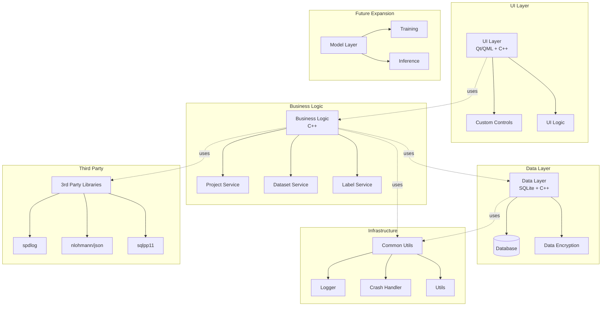

# DeepLearningTool 设计文档

## 1. 项目概述
DeepLearningTool是一个基于C++和Qt框架开发的深度学习辅助工具，专注于提供数据标注、项目管理和模型训练支持功能。本工具旨在简化深度学习工作流，提供直观的用户界面和高效的数据处理能力。

## 2. 系统架构
### 2.1 整体架构

### 2.2 技术栈
- **核心框架**: C++17, Qt 6 (Qt Quick for UI)
- **构建系统**: CMake
- **数据库**: SQLite (通过sqlpp11封装)
- **日志**: spdlog
- **JSON处理**: nlohmann/json
- **版本控制**: Git

## 3. 模块设计
### 3.1 主要模块
- **src/common**: 通用工具组件(日志、崩溃处理、工具函数)
- **src/data**: 数据管理模块(数据库操作、标签数据处理)
- **src/project**: 项目管理模块(数据集、标签类、图像管理)
- **src/ui**: 用户界面组件(自定义控件、UI工具类)
- **src/tool**: 应用程序入口和QML界面
- **src/model**: 预留的模型管理模块

### 3.2 模块详细说明
#### 3.2.1 Common模块
提供全局通用功能：
- 跨平台日志系统(Logger)
- 崩溃处理机制(CrashHandler)
- 通用工具函数(Utils)

#### 3.2.2 Data模块
负责数据持久化和管理：
- 数据库连接和操作(DataBase)
- 标签数据处理(LabelData)

#### 3.2.3 Project模块
管理项目核心业务逻辑：
- 项目生命周期管理(Projects)
- 数据集管理(Datasets)
- 图像和标签管理(Images, Labels)
- 标签类别管理(LabelClasses)
- 项目设置(Settings)

#### 3.2.4 UI模块
提供用户界面组件：
- 自定义UI控件(controls)
- UI工具类(Utils)
- 颜色和字体管理(Color, Font)
- UI日志系统(UILogger)

## 4. 数据流程
### 4.1 项目创建流程
1. 用户通过UI创建新项目
2. Project模块创建项目元数据
3. Data模块将项目信息存入数据库
4. UI更新显示新项目信息

### 4.2 图像标注流程
1. 用户导入图像到数据集
2. 选择图像进行标注
3. 创建/编辑标签信息
4. 标签数据通过Data模块持久化
5. 实时更新项目统计信息

## 5. 功能需求
### 5.1 项目管理
- 创建/打开/保存/删除项目
- 项目设置配置
- 项目元数据管理

### 5.2 数据集管理
- 导入/导出数据集
- 图像文件管理
- 数据集统计信息

### 5.3 标签功能
- 创建/编辑/删除标签类别
- 多种标注工具(矩形、多边形等)
- 标签数据导入/导出

### 5.4 用户界面
- 直观的项目仪表盘
- 图像查看器(支持缩放、平移)
- 标签编辑面板
- 项目设置界面

## 6. 非功能需求
### 6.1 性能要求
- 支持同时加载至少1000张图像
- 图像渲染延迟<100ms
- 数据库操作响应时间<200ms

### 6.2 可靠性要求
- 自动崩溃恢复
- 操作自动保存
- 数据备份机制

### 6.3 兼容性要求
- 支持Windows 10/11 (64位)
- 支持常见图像格式(JPG, PNG, BMP)

## 7. 构建与部署
- 使用CMake构建系统
- 支持Qt 6.2及以上版本
- 提供安装程序和便携版

## 8. 功能增强规划

### 8.1 核心功能深化
#### 8.1.1 模型训练集成
- 支持TensorFlow/PyTorch模型训练流程管理
- 提供模型超参数调优界面和自动化推荐
- 训练进度可视化和实时性能监控

#### 8.1.2 高级标注工具
- AI辅助标注(自动边界框、自动分割建议、相似图像批量标注)

### 8.2 用户体验优化
- 自定义快捷键和工作区布局
- 多视图同步标注(分割/分类/检测任务并行)

## 10. 基础设施架构

### 10.1 CI/CD流水线
- **构建系统**: GitHub Actions + CMake
- **测试自动化**: CTest + Qt Test + 覆盖率报告
- **部署管道**: 自动构建→测试→打包→发布

### 10.2 监控与运维
- 应用性能监控(启动时间、内存占用、响应速度)
- 错误跟踪系统(崩溃报告自动收集与分析)
- 远程诊断工具(支持用户问题远程协助)

## 11. 未来扩展
- 团队协作功能(实时多人标注)
- 云服务集成(云端数据集与模型管理)
- 移动端标注APP(支持平板设备离线标注)

## 12. 运维文档

### 12.1 部署指南
- 硬件要求: 最低配置(i5 CPU, 8GB RAM, 2GB GPU显存)
- 软件依赖: Visual Studio 2019+, Qt 6.2+, CUDA 11.4+
- 安装步骤: 二进制安装包(Windows Installer)或源码编译指南

### 12.2 常见问题排查
- 数据库连接失败: 检查SQLite驱动和文件权限
- 图像加载异常: 验证图像格式和内存使用
- 性能优化建议: 缓存策略配置和资源释放机制
