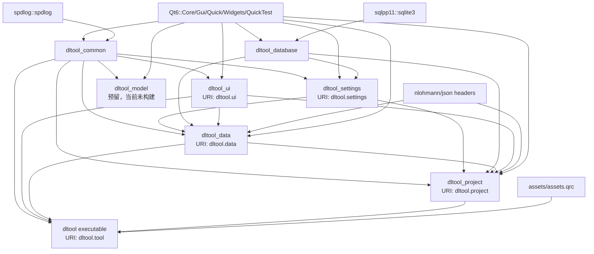
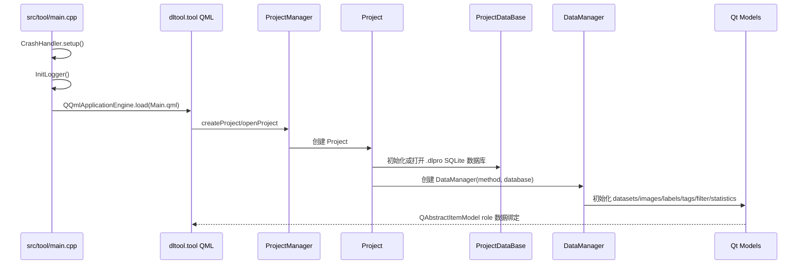

# DeepLearningTool 架构总览

DeepLearningTool 采用“基础设施 + 配置 + 数据库 + 数据模型 + UI 组件 + 项目业务聚合 + 应用入口”的分层结构。构建系统基于 CMake，界面基于 Qt 6/QML，持久化基于 SQLite/sqlpp11。

## 分层与边界

| 层级 | 目标 | 位置 | 边界 |
|------|------|------|------|
| 基础设施 | `dltool_common` | `src/common/` | 日志、崩溃处理、通用文件工具、单例模板；不依赖业务模块 |
| 配置 | `dltool_settings` | `src/settings/` | `GlobalSettings` 聚合项目/数据/UI 设置，通过 `SettingsDataBase` 持久化到 `db/settings.db` |
| 数据库 | `dltool_database` | `src/database/` | SQLite 连接池、项目数据库、最近项目数据库、设置数据库、DDL 和 sqlpp11 表定义 |
| 数据模型 | `dltool_data` | `src/data/` | Qt 模型、数据导入、标注数据结构、图像标签、过滤与统计；通过 `dltool_database` 访问数据库 |
| UI 组件 | `dltool_ui` | `src/ui/` | 主题、字体、图标、日志/进度单例和通用 QML 控件 |
| 项目业务 | `dltool_project` | `src/project/` | 项目创建/打开/关闭、最近项目、业务对象聚合 |
| 应用入口 | `dltool` | `src/tool/` | `main.cpp`、QML 引擎、顶层窗口、Header/Content/Footer 布局 |

约束：

- 低层模块不反向依赖高层模块。
- 数据库访问集中在 `dltool_database`，UI/QML 通过 `DataManager` 和 Qt 模型操作数据。
- 每个库模块由 `add_plugin_library()` 生成同名动态库和 `<target>_header` 头目标。
- QML 模块产物输出到 `${CMAKE_BINARY_DIR}/dltool/<plugin>`。

## 模块依赖

## 运行时主流程

## 数据与持久化

- 项目文件后缀为 `.dlpro`，本质是 SQLite 数据库。
- 表结构定义在 `src/database/include/database/ddl/`，包括 project、recent_projects、settings、datasets、images、label_classes、labels、tag_classes、tags。
- `ProjectDataBase` 提供项目元数据、数据集、图像、标签类别、图像标签和标注实例的读写。
- `SettingsDataBase` 使用软件目录下的 `db/settings.db` 保存全局设置。
- `RecentProjectsDataBase` 使用软件目录下的 `db/history.db` 保存最近项目列表。
- `DataManager` 聚合所有数据模型，并向 QML 暴露统一入口。

## QML 模块

| URI | 目标 | 内容 |
|-----|------|------|
| `dltool.settings` | `dltool_settings` | `GlobalSettings`、`ProjectSettings`、`DataSettings`、`UISettings` |
| `dltool.ui` | `dltool_ui` | `DltColor`、`DltFont`、`UILogger`、`ProgressManager`、`Utils`、`controls/*.qml` |
| `dltool.data` | `dltool_data` | `DataManager`、数据模型、过滤模型、统计模型、Gallery/Label/Review QML |
| `dltool.project` | `dltool_project` | `ProjectManager`、`Project`、项目创建/打开 QML |
| `dltool.tool` | `dltool` | 主窗口、Header、Content、Footer |

`dltool_common` 和 `dltool_database` 当前不生成 QML 模块。

## 构建与第三方

- 根项目启用 C、C++ 和 CUDA 语言，当前 C++ 标准为 C++17。
- 第三方库在 `3rdparty/` 管理：`sqlpp11`、`spdlog`、`nlohmann/json.hpp`。
- `assets/assets.qrc` 通过 `qt_add_big_resources()` 链入 `dltool` 可执行程序。
- `tests/` 当前只启用 `tests/ui`，测试目标为 `tst_dltool_ui`。

## 预留模块

`src/model/` 已有 `CMakeLists.txt`，但没有在 `src/CMakeLists.txt` 中 `add_subdirectory(model)`。该模块是后续模型训练、推理或模型版本管理的预留位置。
