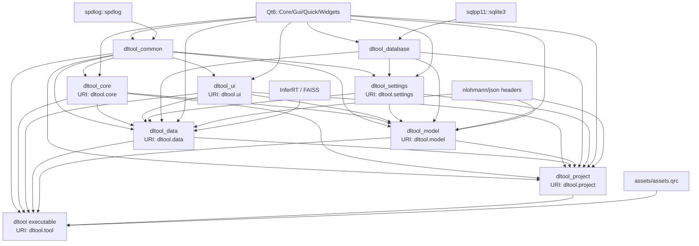
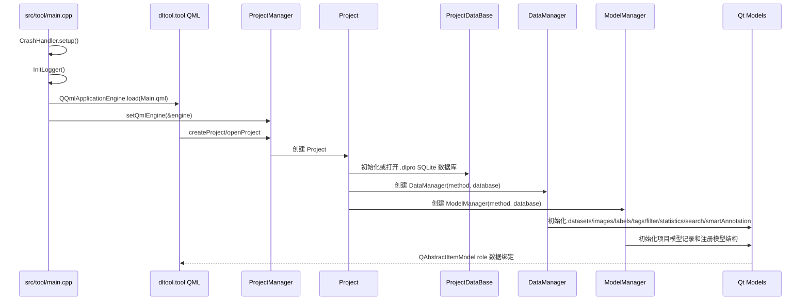

# DeepLearningTool 架构总览

DeepLearningTool 采用“基础设施 + 核心定义 + 数据库 + 设置 + UI 基础组件 + 领域业务模块 + 项目聚合 + 应用入口”的分层结构。构建系统基于 CMake，界面基于 Qt 6/QML，持久化基于 SQLite/sqlpp11。

## 分层与边界

| 层级 | 目标 | 位置 | 边界 |
|------|------|------|------|
| 基础设施 | `dltool_common` | `src/common/` | 日志、崩溃处理、通用文件工具、单例模板；不依赖业务模块 |
| 核心定义 | `dltool_core` | `src/core/` | 深度学习任务类型、跨模块共享枚举和名称映射 |
| 数据库 | `dltool_database` | `src/database/` | SQLite 连接池、项目数据库、最近项目数据库、设置数据库、DDL 和 sqlpp11 表定义 |
| 配置 | `dltool_settings` | `src/settings/` | `GlobalSettings` 聚合项目/数据/高级/UI 设置，通过 `SettingsDataBase` 持久化到 `db/settings.db` |
| UI 组件 | `dltool_ui` | `src/ui/` | 主题、字体、图标、日志/进度单例和通用 QML 控件 |
| 模型管理 | `dltool_model` | `src/model/` | 项目内模型记录、模型结构注册、训练/测试参数模型和训练/测试页面骨架 |
| 数据工作区 | `dltool_data` | `src/data/` | 数据集、图像、标注、标签、过滤、统计、导入导出、图像搜索、智能标注 |
| 项目业务 | `dltool_project` | `src/project/` | 项目创建/打开/关闭、最近项目、`DataManager` 和 `ModelManager` 聚合 |
| 应用入口 | `dltool` | `src/tool/` | `main.cpp`、QML 引擎、顶层窗口、Header/Content/Footer 布局 |

约束：

- 低层模块不反向依赖高层模块。
- 数据库访问集中在 `dltool_database`，UI/QML 通过 manager 和 Qt 模型操作数据。
- 每个库模块由 `add_plugin_library()` 生成同名动态库和 `<target>_header` 头目标。
- QML 模块产物输出到 `${CMAKE_BINARY_DIR}/dltool/<plugin>`。
- `src/` 每个一级模块目录下都有模块级 README，用于补充模块内部架构和边界。

## 模块依赖

## 运行时主流程

## 数据与持久化

- 项目文件后缀为 `.dlpro`，本质是 SQLite 数据库。
- 表结构定义在 `src/database/include/database/ddl/`，包括 project、recent_projects、datasets、images、label_classes、labels、tag_classes、tags、models，以及多类设置表。
- `ProjectDataBase` 提供项目元数据、数据集、图像、标签类别、图像标签、标注实例和模型记录的读写。
- `SettingsDataBase` 使用软件目录下的 `db/settings.db` 保存全局设置，包括图像搜索、智能标注、缩略图、标注显示、图像增强、UI 和项目设置。
- `RecentProjectsDataBase` 使用软件目录下的 `db/history.db` 保存最近项目列表。
- `DataManager` 聚合数据模型，并向 QML 暴露统一入口，同时持有 `ImageSearchController` 和 `SmartAnnotationController`。
- `ModelManager` 聚合项目模型记录，并通过注册表按任务类型实例化模型配置。

## 数据集导入导出

- `DataImporter`/`DataExporter` 作为格式扩展点，`DataManager` 负责调度、批量写库和模型刷新。
- `LabelMeImporter`、`COCOImporter` 将外部格式转换为统一的图像路径、类别信息和标注数据。bbox 标注用于目标检测；LabelMe polygon、COCO polygon `segmentation` 和 COCO RLE `segmentation` 会保留为 `points` 点集，用于语义分割。
- 导入器采用批次信号边解析边交给 `DataManager` 写入，批次大小为 1000 张图像或 1000 条标注。批次信号使用阻塞队列连接，后台解析线程会等待当前批次写库完成后继续，避免内存堆积。
- 单个批次写入失败时只跳过当前批次并记录失败数量，不取消整个导入流程。
- `LabelMeExporter`、`COCOExporter` 从统一的 `ExportDataset` 写出文件。导出目录统一包含 `images/`，LabelMe 标注位于 `annotations/*.json`，COCO 标注位于 `annotations/instances.json`。
- `DatasetIO` 复用图片扫描、JSON 扫描、图像尺寸读取、bbox 裁剪、点集转换、文件拷贝和导出文件名去重逻辑。

## 图像搜索与智能标注

- `ImageSearchController` 基于 InferRT 特征提取与 FAISS 索引，支持 TensorRT / OpenVINO / ONNX Runtime 等模型后端，可对选中图像在数据集图库中执行相似检索。
- 图像搜索结果通过 `ImageSearchFilterModule` 写入 `GlobalFilter`，并与数据集、图片标签、类别过滤按 AND 逻辑组合。
- `SmartAnnotationController` 负责智能标注模型加载、缓存和推理，根据图像路径和提示点返回 QML 可消费的分割结果。
- 图像搜索参数和智能标注参数分别由 `GlobalSettings.advanced.imageSearch`、`GlobalSettings.advanced.smartAnnotation` 持久化。

## 模型管理

- `ModelManager` 从项目数据库的 `models` 表加载模型记录，并提供新增、重命名、删除、复制和模型实例化接口。
- `IModel`、`IModelConfig`、`ITrainParams`、`ITestParams`、`ParamGroupModel` 构成训练/测试参数模型体系。
- 当前注册了目标检测任务下的 YOLOv5 和 YOLOv8 默认参数，真实训练/评估执行仍是后续扩展点。

## QML 模块

| URI | 目标 | 内容 |
|-----|------|------|
| `dltool.core` | `dltool_core` | `DeepLearningMethod` |
| `dltool.settings` | `dltool_settings` | `GlobalSettings`、`ProjectSettings`、`DataSettings`、`AdvancedSettings`、`UISettings` |
| `dltool.ui` | `dltool_ui` | `DltColor`、`DltFont`、`DltFontIcon`、`UILogger`、`ProgressManager`、`Utils`、`controls/*.qml` |
| `dltool.model` | `dltool_model` | `ModelManager`、`IModel`、`IModelConfig`、参数模型、Train/Test QML |
| `dltool.data` | `dltool_data` | `DataManager`、`ImageSearchController`、`SmartAnnotationController`、数据模型、过滤模型、统计模型、Gallery/Label/Review QML |
| `dltool.project` | `dltool_project` | `ProjectManager`、`Project`、项目创建/打开 QML |
| `dltool.tool` | `dltool` | 主窗口、Header、Content、Footer |

`dltool_common` 和 `dltool_database` 当前不生成 QML 模块。

## 构建与第三方

- 根项目启用 C、C++ 和 CUDA 语言，当前 C++ 标准为 C++17。
- `src/CMakeLists.txt` 当前构建顺序为 `common -> core -> database -> settings -> ui -> model -> data -> project -> tool`。
- 第三方库在 `3rdparty/` 管理：`sqlpp11`、`spdlog`、`nlohmann/json.hpp`。
- `data` 模块通过 `setup_inferrt(${PROJECT_NAME}_data)` 接入 InferRT 相关能力。
- `assets/assets.qrc` 通过 `qt_add_big_resources()` 链入 `dltool` 可执行程序。
- `tests/` 当前只启用 `tests/ui`，测试目标为 `tst_dltool_ui`。
