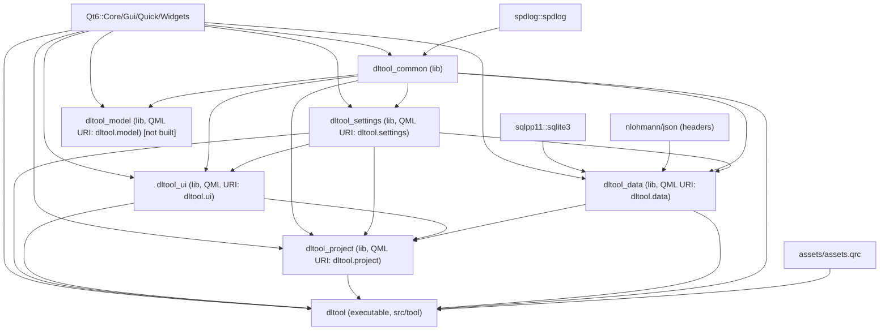
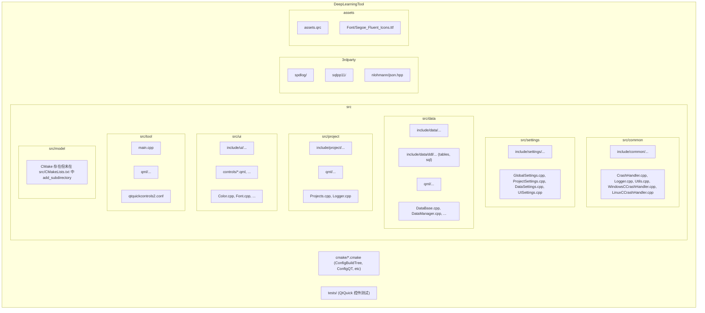

## DeepLearningTool 架构总览

本项目是基于 Qt 6 与 CMake 的跨平台桌面应用，采用“分层 + 模块化 + QML 插件”的架构模式。

### 模块分层与边界
- **基础层 dltool_common**: 通用设施（日志、崩溃处理、工具函数、单例基类）。
- **配置层 dltool_settings**: 全局配置管理（依赖 `common`）。
- **数据层 dltool_data**: 数据库与数据模型（依赖 `common`、`settings`、`sqlpp11::sqlite3`、`nlohmann/json`）。
- **UI 组件层 dltool_ui**: 统一的 UI 主题、控件与工具（依赖 `common`、`settings`）。
- **业务聚合层 dltool_project**: 业务流程编排（依赖 `ui`、`data`、`common`、`settings`）。
- **应用层 dltool（可执行）**: 入口程序与顶层 QML（依赖 `common`、`settings`、`ui`、 `project`、 `data`）。

约束：
- 下层不可反向依赖上层；跨层访问遵循相邻层转发，避免跨层“直通”耦合。
- 公共头通过各模块的 `INTERFACE` 头目标暴露（如 `dltool_common_header`）。

### 模块依赖图（Mermaid）

### 目录结构（Mermaid）

### 构建与第三方
- 构建系统：CMake 3.18+、Qt 6（使用 `qt_add_library`/`qt_add_qml_module`/`qt_add_executable`）。
- 第三方：`spdlog`、`sqlpp11`、`nlohmann/json`。统一在 `3rdparty/` 与 `cmake/` 下管理，禁止在业务代码中直接引入第三方 `add_subdirectory`。
- 头目标：每个模块提供 `INTERFACE` 头目标（如 `dltool_data_header`），供跨模块包含头文件。

### 关键数据流
- UI 事件与模型交互：QML → C++ `QAbstractItemModel`（role 从 `Qt::UserRole + 1` 开始）→ 数据层。
- 数据层：`DataManager` 统一管理连接/事务，`DataBase` 按需装载 DDL 头（位于 `src/data/include/data/ddl/`）。
- 日志：统一通过 `common` 的封装使用 `spdlog`；崩溃时 `CrashHandler` 负责最小化诊断输出。

### QML 插件与资源
- 各模块 QML 使用独立 URI：`dltool.common/ui/data/project`，产物输出到 `${CMAKE_BINARY_DIR}/${PROJECT_NAME}/${PLUGIN_NAME}`。
- 统一资源清单 `assets/assets.qrc`；字体、图标等归档到 `assets/Font` 等子目录。

### 未来模块
- `src/model` 当前 CMake 存在但未被 `src/CMakeLists.txt` 引入，作为后续扩展预留位，未来用于模型管理。

