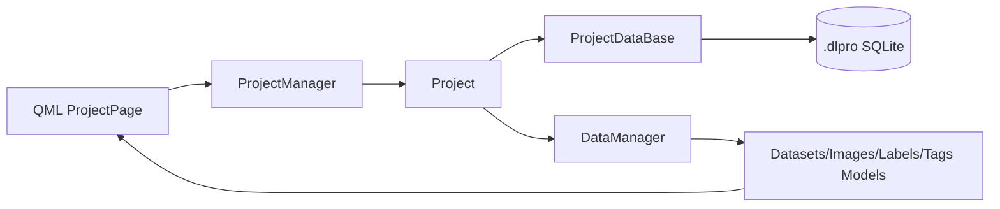
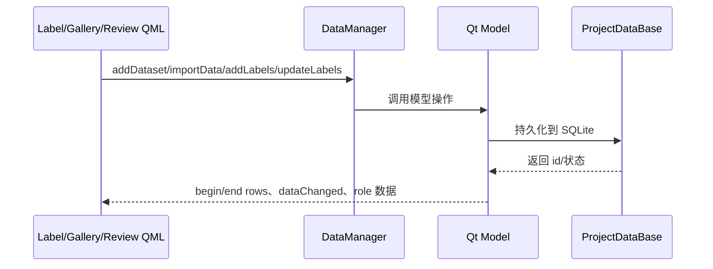

# DeepLearningTool 代码结构

## 1. 项目概述

DeepLearningTool (`dltool`) 是一个 Qt 6/QML 桌面应用，主要用于深度学习数据标注。当前实现以项目文件为中心，支持数据集管理、图像导入、目标检测标注、语义分割多边形标注、图像标签、过滤、类别统计和最近项目管理。

## 2. 技术栈

| 类别 | 当前选型 |
|------|----------|
| 编程语言 | C++17，QML |
| UI 框架 | Qt 6 / Qt Quick / Qt Quick Controls |
| 构建系统 | CMake 3.18+ |
| 数据库 | SQLite + sqlpp11 |
| 日志 | spdlog |
| JSON | nlohmann/json |
| 资源 | Qt resource (`assets/assets.qrc`) |
| 测试 | Qt Quick Test + CTest |

## 3. 顶层目录

```text
DeepLearningTool/
├── 3rdparty/                 # sqlpp11、spdlog、nlohmann/json
├── assets/                   # Qt 资源、字体、图标字体
├── cmake/                    # CMake 配置与 add_plugin_library()
├── docs/                     # 项目文档
├── src/                      # 主源码
├── tests/                    # Qt Quick/UI 测试
├── tools/                    # 辅助脚本
├── CMakeLists.txt            # 根构建脚本
├── DESIGN.md                 # 产品设计说明
└── README.md                 # 项目简介
```

## 4. 构建入口

根 `CMakeLists.txt`：

- 项目名：`dltool`，长名称：`DeepLearningTool`。
- 版本：`0.0.1`，后缀：`-beta`。
- 启用语言：C、C++、CUDA。
- 选项：`DLT_BUILD_TESTS`、`DLT_BUILD_DOCS`、`DLT_ENABLE_SANITIZER`。
- 加载 `cmake/ConfigBuildTree.cmake`、`ConfigCompiler.cmake`、`ConfigQT.cmake`、`ConfigSQLite.cmake`、`AddPluginLibrary.cmake`。
- 添加 `3rdparty/`、`src/`，并在 `DLT_BUILD_TESTS=ON` 时添加 `tests/`。

`src/CMakeLists.txt` 当前构建：

```cmake
add_subdirectory(common)
add_subdirectory(database)
add_subdirectory(settings)
add_subdirectory(project)
add_subdirectory(data)
add_subdirectory(ui)
add_subdirectory(tool)
```

`src/model/` 存在但未被构建。

## 5. 模块结构

### 5.1 Common (`dltool_common`)

位置：`src/common/`

职责：

- `Logger`：封装默认 spdlog sinks 和 logger 创建。
- `CrashHandler`：跨平台崩溃处理入口，Windows 使用 `Dbghelp`，Linux 使用 `dl`。
- `Singleton<T>`：C++/QML 单例模板和宏。
- `Utils`、`FileReader`：UUID、路径、文件扫描和格式转换工具。

结构：

```text
src/common/
├── include/common/
│   ├── CommonExport.h
│   ├── CrashHandler.h
│   ├── LinuxCCrashHandler.h
│   ├── Logger.h
│   ├── Singleton.h
│   ├── Utils.h
│   └── WindowsCCrashHandler.h
├── CrashHandler.cpp
├── LinuxCCrashHandler.cpp
├── Logger.cpp
├── Utils.cpp
└── WindowsCCrashHandler.cpp
```

### 5.2 Settings (`dltool_settings`, URI `dltool.settings`)

位置：`src/settings/`

职责：

- `GlobalSettings`：QML 单例，聚合项目、数据和 UI 设置，通过 `SettingsDataBase` 保存到软件目录下的 `db/settings.db`。
- `ProjectSettings`：最近项目数量、自动保存间隔、自动保存开关。
- `DataSettings`：缩略图、图像加载、标注显示、图像网格缩放、标注缩略图参数。
- `UISettings`：图像亮度/对比度、主题、语言。

结构：

```text
src/settings/
├── include/settings/
│   ├── DataSettings.h
│   ├── GlobalSettings.h
│   ├── ProjectSettings.h
│   ├── SettingsExport.h
│   └── UISettings.h
├── DataSettings.cpp
├── GlobalSettings.cpp
├── ProjectSettings.cpp
└── UISettings.cpp
```

### 5.3 Database (`dltool_database`)

位置：`src/database/`

职责：

- `DataBase`：SQLite 连接池、数据库文件创建，以及软件目录 `db/` 路径生成。
- `ProjectDataBase`：`.dlpro` 项目库读写。
- `RecentProjectsDataBase`：最近项目 `db/history.db` 读写。
- `SettingsDataBase`：全局设置 `db/settings.db` 读写。
- `SqlDef` 和 `ddl/`：sqlpp11 表定义与建表 SQL。

结构：

```text
src/database/
├── include/database/
│   ├── ddl/
│   │   ├── create_datasets.sql
│   │   ├── create_images.sql
│   │   ├── create_label_classes.sql
│   │   ├── create_labels.sql
│   │   ├── create_project.sql
│   │   ├── create_recent_projects.sql
│   │   ├── create_settings.sql
│   │   ├── create_tag_classes.sql
│   │   ├── create_tags.sql
│   │   └── *Table.h
│   ├── DataBase.h
│   ├── DatabaseExport.h
│   └── SqlDef.h
└── DataBase.cpp
```

### 5.4 Data (`dltool_data`, URI `dltool.data`)

位置：`src/data/`

职责：

- 数据模型：`DatasetsListModel`、`ImageInstancesListModel`、`LabelClassesListModel`、`ImageTagsListModel`、`LabelInstancesListModel`、`ImageLabelsListModel`、`ImageLabelsTableModel`、`ImageInfoListModel`。
- 数据聚合：`DataManager` 统一创建和暴露模型。
- 数据导入：`DataImporter`、`LabelMeImporter`、`COCOImporter`，通过 `DatasetIO` 复用图片扫描、JSON 扫描、bbox 与多边形点集转换等公共逻辑。
- 数据导出：`DataExporter`、`LabelMeExporter`、`COCOExporter`。导出时 `DataManager` 先组装统一的 `ExportDataset`，格式类负责写出目录结构和标注文件；带 `points` 的标注会导出为 LabelMe polygon 或 COCO segmentation。
- 标注数据：`LabelData_t`、`DetLabelData_t`、`SegLabelData_t`、`LabelDataHelper_t`，其中 `SegLabelDataHelper` 负责多边形命中测试、顶点拖拽和整体移动。
- 过滤：`GlobalFilter`、`DatasetFilterModule`、`TagFilterModule`、`LabelClassFilterModule`、`ImageLabelClassFilterModule`、`FilterItemsModel`。
- 统计：`CategoryStatisticsModel`。
- QML 页面：Gallery、Label、Review 和公共组件。

结构：

```text
src/data/
├── include/data/
│   ├── CategoryStatisticsModel.h
│   ├── CoreDef.h
│   ├── DataFormat.h
│   ├── DataExporter.h
│   ├── DataImporter.h
│   ├── DatasetIO.h
│   ├── DataManager.h
│   ├── Datasets.h
│   ├── FilterItemsModel.h
│   ├── GlobalFilter.h
│   ├── Images.h
│   ├── ImageTags.h
│   ├── LabelClasses.h
│   ├── LabelData.h
│   └── Labels.h
├── qml/
│   ├── component/
│   ├── gallery/
│   ├── label/
│   ├── review/
│   ├── GalleryPage.qml
│   ├── LabelPage.qml
│   └── ReviewPage.qml
└── *.cpp
```

### 5.5 UI (`dltool_ui`, URI `dltool.ui`)

位置：`src/ui/`

职责：

- `DltColor`、`DltFont`、`DltFontIcon`：主题颜色、字体、图标枚举。
- `UILogger`：接收 spdlog sink 的 QML 日志单例。
- `ProgressManager`：长任务进度和消息队列。
- `Utils`：QML 可调用的路径/颜色/文件管理器工具。
- `controls/`：统一样式的 QML 控件。

结构：

```text
src/ui/
├── include/ui/
│   ├── Color.h
│   ├── Def.h
│   ├── Font.h
│   ├── IconsFont.h
│   ├── ProgressManager.h
│   ├── SignalHelper.h
│   ├── UILogger.h
│   └── Utils.h
├── controls/
│   ├── DltButton.qml
│   ├── DltCheckBox.qml
│   ├── DltComboBox.qml
│   ├── DltContentDialog.qml
│   ├── DltEditor.qml
│   ├── DltProgressBar.qml
│   ├── DltScrollablePage.qml
│   ├── DltSlider.qml
│   ├── DltText*.qml
│   └── ...
└── *.cpp
```

### 5.6 Project (`dltool_project`, URI `dltool.project`)

位置：`src/project/`

职责：

- `Project`：项目实体，持有 `ProjectDataBase` 和 `DataManager`。
- `RectentProjects`：最近项目列表模型，保留了当前代码中的类名拼写。
- `ProjectManager`：QML 单例，负责创建、打开、关闭、删除项目和读取项目信息。
- QML 页面：项目首页、创建器、打开器、历史列表、项目信息表单。

结构：

```text
src/project/
├── include/project/
│   ├── Logger.h
│   ├── ProjectExport.h
│   └── Projects.h
├── qml/
│   ├── project/
│   └── ProjectPage.qml
├── Logger.cpp
└── Projects.cpp
```

### 5.7 Tool (`dltool`, URI `dltool.tool`)

位置：`src/tool/`

职责：

- `main.cpp`：安装崩溃处理、初始化日志、创建 `QApplication` 和 `QQmlApplicationEngine`。
- `Main.qml`：主窗口入口。
- `Content.qml`：主要页面容器。
- `header/`、`footer/`：顶部导航和底部日志/进度状态区。
- `qtquickcontrols2.conf`：Qt Quick Controls 配置。

结构：

```text
src/tool/
├── qml/
│   ├── footer/
│   ├── header/
│   ├── Content.qml
│   └── Main.qml
├── main.cpp
└── qtquickcontrols2.conf
```

## 6. 数据流

### 6.1 项目打开/创建



### 6.2 标注与 UI 更新



### 6.3 过滤与统计

`GlobalFilter` 聚合四类过滤条件：

- `Dataset`：按数据集过滤图像。
- `Tag`：按图像标签过滤图像。
- `LabelClass`：按标注类别过滤标注实例。
- `ImageLabelClass`：按图像是否包含指定标注类别过滤图像。

过滤项由 `DatasetFilterItemsModel`、`TagFilterItemsModel`、`LabelClassFilterItemsModel` 提供；类别统计由 `CategoryStatisticsModel` 提供。

## 7. 构建目标

| 目标 | 类型 | QML URI | 说明 |
|------|------|---------|------|
| `dltool_common` | shared library | 无 | 基础设施 |
| `dltool_settings` | shared library | `dltool.settings` | 设置 |
| `dltool_database` | shared library | 无 | SQLite/sqlpp11 |
| `dltool_data` | shared library | `dltool.data` | 数据模型和页面 |
| `dltool_ui` | shared library | `dltool.ui` | UI 控件和主题 |
| `dltool_project` | shared library | `dltool.project` | 项目业务 |
| `dltool` | executable | `dltool.tool` | 应用入口 |
| `tst_dltool_ui` | test executable | - | UI/QML 测试 |

## 8. 测试结构

```text
tests/
├── CMakeLists.txt
├── test_registry.h
├── test_runner.h
└── ui/
    ├── CMakeLists.txt
    ├── main.cpp
    ├── test_Utils.cpp
    ├── test_Utils.h
    ├── tst_main.qml
    ├── DltButtonTest.qml
    ├── DltComboBoxTest.qml
    ├── DltEditorTest.qml
    ├── DltTextIconButtonTest.qml
    └── DltTextTest.qml
```

当前 `tests/CMakeLists.txt` 只启用了 `tests/ui`。

## 9. 资源

- `assets/assets.qrc`：主资源清单，由 `src/tool/CMakeLists.txt` 使用 `qt_add_big_resources()` 链入可执行程序。
- `assets/Font/Segoe_Fluent_Icons.ttf`：图标字体。
- UI 控件和页面 QML 由各模块的 `qt_add_qml_module()` 收集并生成模块资源。
