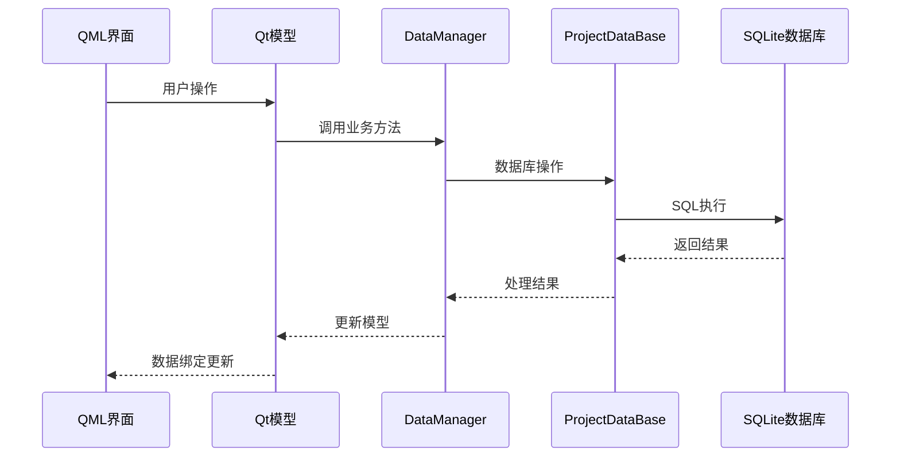

# DeepLearningTool 代码结构文档

## 1. 项目概述

DeepLearningTool (dltool) 是一个基于 C++17 和 Qt 6 开发的深度学习数据标注工具，采用分层模块化架构设计，支持项目管理、数据集管理、图像标注等核心功能。

## 2. 技术栈

| 类别 | 技术选型 |
|------|----------|
| 编程语言 | C++17 |
| UI框架 | Qt 6 (Qt Quick/QML) |
| 构建系统 | CMake 3.18+ |
| 数据库 | SQLite (sqlpp11) |
| 日志系统 | spdlog |
| JSON处理 | nlohmann/json |
| GPU支持 | CUDA |

## 3. 目录结构

```
DeepLearningTool/
├── 3rdparty/                    # 第三方库
│   ├── nlohmann/                # JSON库
│   ├── spdlog/                  # 日志库
│   └── sqlpp11/                 # SQL库
├── assets/                      # 资源文件
│   ├── assets.qrc               # Qt资源文件
│   └── Font/                    # 字体文件
├── cmake/                       # CMake配置模块
│   ├── ConfigBuildTree.cmake
│   ├── ConfigCompiler.cmake
│   ├── ConfigCUDA.cmake
│   ├── ConfigQT.cmake
│   ├── ConfigSQLite.cmake
│   └── PrintConfig.cmake
├── docs/                        # 文档目录
├── src/                         # 源代码
│   ├── common/                  # 通用模块
│   ├── settings/                # 配置管理模块
│   ├── data/                    # 数据层模块
│   ├── model/                   # 模型模块(预留)
│   ├── project/                 # 项目管理模块
│   ├── tool/                    # 应用入口
│   └── ui/                      # UI组件模块
├── tests/                       # 测试代码
└── tools/                       # 构建工具脚本
```

## 4. 模块架构

### 4.1 架构分层图

```mermaid
flowchart TB
    subgraph Application["应用层"]
        exe["dltool (可执行程序)"]
    end
    
    subgraph Business["业务层"]
        project["dltool_project"]
    end
    
    subgraph Presentation["表现层"]
        ui["dltool_ui"]
    end
    
    subgraph Data["数据层"]
        data["dltool_data"]
    end
    
    subgraph Configuration["配置层"]
        settings["dltool_settings"]
    end
    
    subgraph Infrastructure["基础设施层"]
        common["dltool_common"]
    end
    
    subgraph ThirdParty["第三方库"]
        qt6["Qt6"]
        spdlog["spdlog"]
        sqlpp11["sqlpp11"]
        nlohmann["nlohmann/json"]
    end
    
    exe --> project
    exe --> ui
    exe --> data
    exe --> settings
    exe --> common
    
    project --> ui
    project --> data
    project --> settings
    project --> common
    
    ui --> settings
    ui --> common
    
    data --> settings
    data --> common
    
    settings --> common
    
    common --> qt6
    common --> spdlog
    data --> sqlpp11
    data --> nlohmann
```



### 4.2 模块依赖关系

| 模块 | 依赖 | QML URI |
|------|------|---------|
| dltool_common | Qt6::Core, spdlog | - |
| dltool_settings | dltool_common, Qt6::Qml | dltool.settings |
| dltool_ui | dltool_common, dltool_settings, Qt6::Quick | dltool.ui |
| dltool_data | dltool_common, dltool_settings, sqlpp11, nlohmann | dltool.data |
| dltool_project | dltool_ui, dltool_data, dltool_settings, dltool_common | dltool.project |
| dltool (exe) | 所有模块 | dltool.tool |

## 5. 模块详细说明

### 5.1 Common 模块 (dltool_common)

**职责**: 提供全局通用功能和基础设施

**目录结构**:
```
src/common/
├── include/common/
│   ├── CommonExport.h          # 导出宏定义
│   ├── CrashHandler.h          # 崩溃处理接口
│   ├── LinuxCCrashHandler.h    # Linux崩溃处理
│   ├── WindowsCCrashHandler.h  # Windows崩溃处理
│   ├── Logger.h                # 日志系统
│   ├── Singleton.h             # 单例模板
│   └── Utils.h                 # 工具函数
├── CrashHandler.cpp
├── LinuxCCrashHandler.cpp
├── WindowsCCrashHandler.cpp
├── Logger.cpp
└── Utils.cpp
```

**核心类**:

| 类名 | 说明 |
|------|------|
| `CrashHandler` | 跨平台崩溃处理器 |
| `Logger` | 基于spdlog的日志封装 |
| `Singleton<T>` | 单例模板类 |
| `Utils` | 通用工具函数 |

### 5.2 Settings 模块 (dltool_settings)

**职责**: 全局配置管理，提供统一的设置访问接口

**目录结构**:
```
src/settings/
├── include/settings/
│   ├── SettingsExport.h        # 导出宏定义
│   ├── GlobalSettings.h        # 全局设置单例
│   ├── ProjectSettings.h       # 项目相关设置
│   ├── DataSettings.h          # 数据相关设置
│   └── UISettings.h            # UI相关设置
├── GlobalSettings.cpp
├── ProjectSettings.cpp
├── DataSettings.cpp
└── UISettings.cpp
```

**核心类**:

| 类名 | 说明 |
|------|------|
| `GlobalSettings` | 全局设置单例，统一管理所有设置 |
| `ProjectSettings` | 项目相关设置（自动保存、最近项目等） |
| `DataSettings` | 数据处理设置（缩略图、图像加载等） |
| `UISettings` | 界面设置（主题、亮度、对比度等） |

**设置分类**:

1. **ProjectSettings** - 项目管理相关
   - maxRecentProjects: 最近项目数量限制（默认10）
   - autoSaveInterval: 自动保存间隔（默认300秒）
   - autoSaveEnabled: 是否启用自动保存（默认true）

2. **DataSettings** - 数据处理相关
   - thumbnailMargin: 缩略图边距（默认10）
   - thumbnailCacheSize: 缩略图缓存大小（默认100MB）
   - imageLoadThreads: 图像加载线程数（默认4）
   - labelBorderWidth: 标注边框宽度（默认2）
   - labelFillOpacity: 标注填充透明度（默认30%）

3. **UISettings** - 界面显示相关
   - imageCellScale: 图像单元格缩放（默认1.0）
   - imageBrightness: 图像亮度（默认0.0，范围-1.0到1.0）
   - imageContrast: 图像对比度（默认0.0，范围-1.0到1.0）
   - theme: 主题（默认"dark"）
   - language: 语言（默认"zh_CN"）

**使用示例**:

C++:
```cpp
#include "settings/GlobalSettings.h"

// 访问设置
auto* settings = dltool::settings::GlobalSettings::getInstance();
int margin = settings->data()->thumbnailMargin();
double brightness = settings->ui()->imageBrightness();

// 修改设置
settings->data()->setThumbnailMargin(15);
settings->save();  // 保存到磁盘
```

QML:
```qml
import dltool.settings

Item {
    // 读取设置
    property int margin: GlobalSettings.data.thumbnailMargin
    
    // 修改设置
    Slider {
        value: GlobalSettings.data.thumbnailMargin
        onValueChanged: GlobalSettings.data.thumbnailMargin = value
    }
    
    // 保存设置
    Button {
        text: "保存"
        onClicked: GlobalSettings.save()
    }
}
```

### 5.3 Data 模块 (dltool_data)

**职责**: 数据持久化、数据库操作、数据模型管理

**目录结构**:
```
src/data/
├── include/data/
│   ├── ddl/                    # 数据库DDL定义
│   ├── CoreDef.h               # 核心定义
│   ├── DataBase.h              # 数据库连接管理
│   ├── DataExport.h            # 导出宏
│   ├── DataFormat.h            # 数据格式定义
│   ├── DataManager.h           # 数据管理器
│   ├── Datasets.h              # 数据集模型
│   ├── Images.h                # 图像模型
│   ├── ImageTags.h             # 图像标签模型
│   ├── LabelClasses.h          # 标签类别模型
│   ├── LabelData.h             # 标签数据
│   ├── Labels.h                # 标签模型
│   ├── Logger.h                # 数据层日志
│   └── SqlDef.h                # SQL定义
├── qml/                        # QML界面
│   ├── component/              # 组件
│   ├── gallery/                # 图库页面
│   ├── label/                  # 标注页面
│   ├── GalleryPage.qml
│   └── LabelPage.qml
└── *.cpp                       # 实现文件
```

**核心类**:

| 类名 | 说明 |
|------|------|
| `DataBase` | 数据库基类，管理SQLite连接池 |
| `ProjectDataBase` | 项目数据库，管理项目相关数据 |
| `RecentProjectsDataBase` | 最近项目数据库 |
| `DataManager` | 数据管理器，统一管理所有数据模型 |
| `DatasetsListModel` | 数据集列表模型 |
| `ImageInstancesListModel` | 图像实例列表模型 |
| `LabelClassesListModel` | 标签类别列表模型 |
| `ImageTagsListModel` | 图像标签列表模型 |
| `LabelInstancesListModel` | 标签实例列表模型 |

### 5.4 UI 模块 (dltool_ui)

**职责**: 提供统一的UI主题、自定义控件和UI工具

**目录结构**:
```
src/ui/
├── include/ui/
│   ├── Color.h                 # 颜色管理
│   ├── Def.h                   # UI定义
│   ├── Font.h                  # 字体管理
│   ├── IconsFont.h             # 图标字体
│   ├── SignalHelper.h          # 信号辅助
│   ├── UIExport.h              # 导出宏
│   ├── UILogger.h              # UI日志
│   └── Utils.h                 # UI工具
├── controls/                   # 自定义QML控件
│   ├── DltButton.qml
│   ├── DltComboBox.qml
│   ├── DltContentDialog.qml
│   ├── DltEditor.qml
│   ├── DltFilledButton.qml
│   ├── DltMenu.qml
│   ├── DltPage.qml
│   ├── DltPopup.qml
│   ├── DltProgressBar.qml
│   ├── DltScrollBar.qml
│   ├── DltSlider.qml
│   ├── DltSplitView.qml
│   ├── DltTabButton.qml
│   ├── DltText.qml
│   ├── DltTextArea.qml
│   ├── DltTextField.qml
│   ├── DltToolTip.qml
│   └── ...
└── *.cpp                       # 实现文件
```

**自定义控件列表**:

| 控件名 | 说明 |
|--------|------|
| `DltButton` | 标准按钮 |
| `DltFilledButton` | 填充按钮 |
| `DltTextIconButton` | 图标文字按钮 |
| `DltComboBox` | 下拉框 |
| `DltTextField` | 文本输入框 |
| `DltTextArea` | 多行文本框 |
| `DltEditor` | 编辑器 |
| `DltContentDialog` | 内容对话框 |
| `DltMenu` | 菜单 |
| `DltPopup` | 弹出框 |
| `DltProgressBar` | 进度条 |
| `DltSlider` | 滑块 |
| `DltScrollBar` | 滚动条 |
| `DltSplitView` | 分割视图 |
| `DltPage` | 页面容器 |
| `DltScrollablePage` | 可滚动页面 |

### 5.5 Project 模块 (dltool_project)

**职责**: 项目生命周期管理、业务流程编排

**目录结构**:
```
src/project/
├── include/project/
│   ├── Logger.h                # 项目层日志
│   ├── ProjectExport.h         # 导出宏
│   ├── Projects.h              # 项目管理
│   └── Settings.h              # 项目设置
├── qml/
│   ├── project/                # 项目相关QML
│   └── ProjectPage.qml         # 项目页面
├── Logger.cpp
├── Projects.cpp
└── Settings.cpp
```

**核心类**:

| 类名 | 说明 |
|------|------|
| `Project` | 项目实体类，包含项目元数据和数据管理器 |
| `RectentProjects` | 最近项目列表模型 |
| `ProjectManager` | 项目管理器单例，管理项目创建/打开/关闭 |
| `Settings` | 项目设置管理 |

### 5.6 Tool 模块 (dltool 可执行程序)

**职责**: 应用程序入口、顶层QML界面

**目录结构**:
```
src/tool/
├── qml/
│   ├── header/                 # 头部导航
│   ├── footer/                 # 底部状态栏
│   ├── Main.qml                # 主窗口
│   └── Content.qml             # 内容区域
├── main.cpp                    # 程序入口
└── qtquickcontrols2.conf       # Qt Quick控件配置
```

## 6. 数据流架构

### 6.1 整体数据流



### 6.2 项目创建流程


## 7. QML模块系统

### 7.1 QML URI映射

| URI | 模块 | 说明 |
|-----|------|------|
| `dltool.common` | dltool_common | 通用组件 |
| `dltool.settings` | dltool_settings | 配置管理 |
| `dltool.ui` | dltool_ui | UI控件库 |
| `dltool.data` | dltool_data | 数据模型 |
| `dltool.project` | dltool_project | 项目管理 |
| `dltool.tool` | dltool | 应用入口 |

### 7.2 QML导入示例

```qml
import dltool.ui          // 导入UI控件
import dltool.settings    // 导入配置管理
import dltool.project     // 导入项目管理
import dltool.data        // 导入数据模型
```

## 8. 构建配置

### 8.1 CMake选项

| 选项 | 默认值 | 说明 |
|------|--------|------|
| `DLT_BUILD_TESTS` | ON | 启用测试 |
| `DLT_BUILD_DOCS` | OFF | 构建文档 |
| `DLT_ENABLE_SANITIZER` | OFF | 启用内存检测 |

### 8.2 构建目标

| 目标 | 类型 | 输出目录 |
|------|------|----------|
| `dltool_common` | 动态库 | `build/dltool/common/` |
| `dltool_ui` | 动态库 | `build/dltool/ui/` |
| `dltool_data` | 动态库 | `build/dltool/data/` |
| `dltool_project` | 动态库 | `build/dltool/project/` |
| `dltool` | 可执行 | `build/bin/` |

## 9. 测试结构

```
tests/
├── CMakeLists.txt
├── test_registry.h             # 测试注册
├── test_runner.h               # 测试运行器
├── project/                    # 项目模块测试
└── ui/                         # UI模块测试
    ├── DltButtonTest.qml
    ├── DltComboBoxTest.qml
    ├── DltEditorTest.qml
    ├── DltTextIconButtonTest.qml
    ├── DltTextTest.qml
    └── ...
```

## 10. 扩展点

### 10.1 Model模块 (预留)

`src/model/` 目录已创建但未启用，预留用于：
- 模型训练管理
- 模型推理服务
- 模型版本控制

### 10.2 插件系统

基于Qt QML模块系统，可扩展：
- 自定义标注工具
- 数据格式导入/导出插件
- 第三方服务集成
