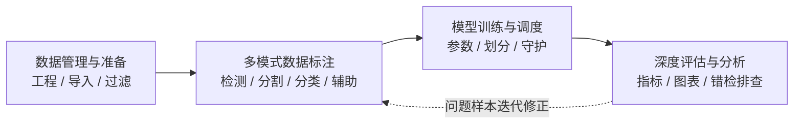
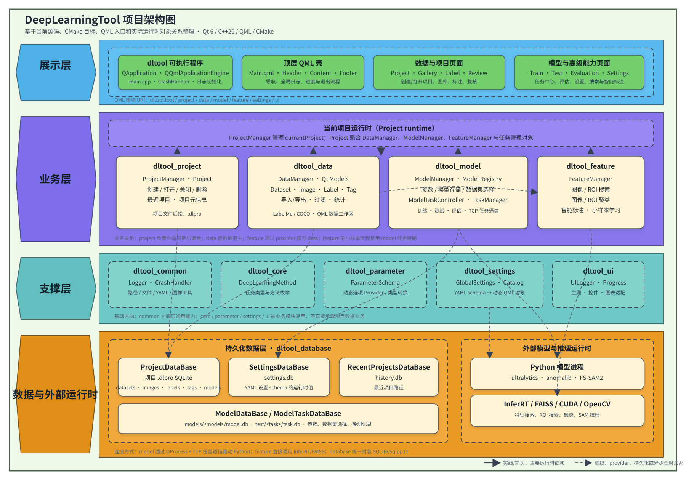
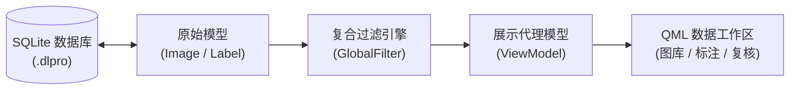
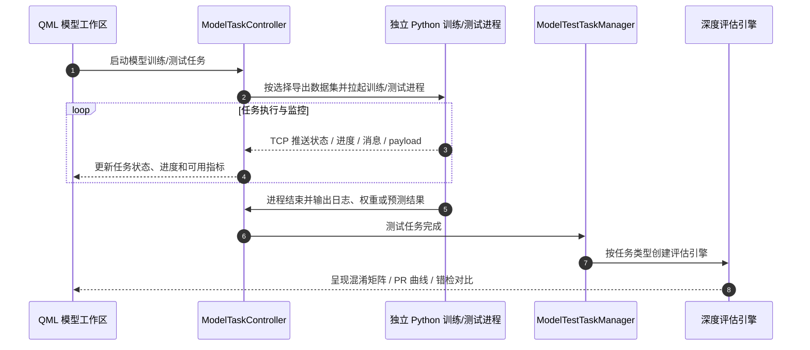

# DeepLearningTool 开发与架构文档

DeepLearningTool（简称 `dltool`）是一个基于 **C++20** 与 **Qt 6 / QML** 开发的桌面级深度学习工具。整个系统的核心聚焦于**数据管理**（工程组织、数据集管理、多模式数据标注、分批导入导出）与**模型管理**（模型架构配置、训练/测试任务调度、模型推理与多维评估）两大核心业务主线，以 `.dlpro`（SQLite 单文件工程）为项目数据载体，并结合模型/测试任务目录保存运行时文件。

---

## 1. 业务流程全景

系统从宏观层面构建了从数据准备到模型评估迭代的端到端闭环：



### 1.1 业务阶段详细展开

1. **数据管理与准备**
   - **单文件工程载体**：基于 SQLite 构建 `.dlpro` 工程文件，将数据集、图片路径、图像附加数据、标注信息、图片标签与项目级模型记录集中存储；模型参数、测试任务和预测记录另由模型目录下的数据库保存；
   - **多格式分批 IO**：按任务类型支持 COCO、LabelMe、Mask 和 Folder 格式，导入解析在后台线程执行，并以最多 256 张图像/标注为一批回传到数据管理器写入；
   - **复合过滤与统计**：支持数据集、图片标签、标注类别等多维度正反向组合过滤（`GlobalFilter`），实时计算类别数量与面积分布。

2. **多模式数据标注**
   - **全任务标注**：支持目标检测（矩形框）、语义/实例分割（多边形点集）、图像级分类与异常检测；
   - **辅助标注功能**：集成 SAM 交互式分割提示（Point/Box Prompt）、以图搜图与局部 ROI 相似检索（基于 InferRT + FAISS），作为标注效率的辅助增强手段。

3. **模型训练与调度**
   - **模型架构注册**：预置 YOLOv5/v8（目标检测）、YOLOv8-seg（语义分割）、PatchCore/Dinomaly2（异常检测）以及 FS-SAM2 相关模型任务；
   - **参数体系与设备探测**：基于 YAML Schema 动态生成参数表单，自动探测系统中可用的 CUDA GPU 设备；
   - **任务调度与进程守护**：通过 `ModelTaskController` 按用户选择的 Train/Validation/Test 数据集导出任务输入，在独立 Python 进程中执行训练或测试，并通过本地 TCP 通信回传任务状态、进度、消息和扩展 payload。

4. **深度评估与分析**
   - **多维算法评估**：按任务计算 IoU 匹配、Precision、Recall、F1、PR/AP/mAP，以及异常分数相关指标；具体指标由任务类型和预测结果能力决定；
   - **可视化深度诊断**：生成交互式混淆矩阵、Precision-Recall 曲线、分数分布和按类别指标，并支持置信度、IoU、类别等筛选；
   - **错检样本直观排查**：展示真值与预测实例、错误事件和缩略图，支持按样本和评估结果筛选定位问题图片。

---

## 2. 系统分层架构与核心解析



> 本架构按当前最新源码整理，涵盖实际运行时对象关系、CMake 编译目标与 QML 模块交互。

### 2.1 架构核心判断与定位

- **`dltool` 是应用入口与界面装配层**：`src/tool/main.cpp` 负责创建 Qt 应用与 QML 引擎，`Main.qml` 负责顶层窗口；`Content.qml` 将项目、图库、标注、复核、训练和测试页面装配起来，不直接承载底层业务逻辑；
- **`project::Project` 是运行时聚合根**：`ProjectManager` 管理当前项目生命周期；`Project` 实体在打开项目后持有 `DataManager`、`ModelManager`、`FeatureManager`、`ModelTaskController`、`ModelTestTaskManager` 和 `TaskManager`；
- **`data` 是数据工作区与数据宿主**：管理数据集、图像列表、标注实例、图片标签、复合过滤、统计计算、COCO/LabelMe/Mask/Folder 导入导出及 QML 数据模型；
- **`model` 是模型与评估全链路中心**：不仅管理模型记录和参数，还包含模型注册、训练/测试任务准备、外部 Python 进程拉起、TCP 任务通信、模型存储与多任务深度评估引擎；
- **`feature` 是基于 Provider 的辅助增强层**：通过 Provider 接口访问 `data`，提供以图搜图、ROI 搜索、图像/ROI 聚类、智能标注与小样本学习；其中小样本学习复用 `model` 的任务编排链路；
- **`database` 统一封装 SQLite / sqlpp11**：针对项目数据（`.dlpro`）、全局设置（`settings.db`）、历史工程（`history.db`）与模型/测试任务数据库分别提供专用访问对象和 schema；
- **`settings` 与 `parameter` 提供参数元数据与持久化**：`settings` 从 `config/settings/*.yaml` 构建 schema、动态字段与 QML 对象，并通过 `SettingsDataBase` 保存运行时值；`parameter` 提供共享参数 schema 与动态选项 provider。

---

### 2.2 主要运行与调用链路

#### 1. 全局业务调用主链路
```text
QML 页面
  -> ProjectManager.currentProject
  -> Project (聚合根)
  -> DataManager / ModelManager / FeatureManager
  -> ProjectDataBase / ModelDataBase / SettingsDataBase
  -> SQLite 数据库、本地文件系统、InferRT/FAISS 或 Python 模型进程
```

#### 2. 模型训练与评估任务执行链路
```text
Train/Test QML 界面
  -> ModelTaskController
  -> TaskManager (任务状态与任务中心)
  -> DataManager (异步导出规范化数据集)
  -> ModelTaskPreparation / ModelStorageService
  -> ExternalModelTaskRunner (独立 Python 训练/测试进程)
  -> TaskCommunicationServer (TCP 任务状态与进度通信)
  -> TaskManager / ModelTestTaskManager / ModelEvaluationViewModel (评估与可视化展示)
```

> **架构图关系说明**：架构图中的虚线表示 Provider 适配、数据库持久化或异步后台任务关系；这类关系并非单纯的“上层直接调用下层”，而是通过对象组合、接口适配器模式或后台线程回调实现松耦合解耦。

---

## 3. 核心模块清单与职责矩阵

| 层次划分 | 模块名称 | 源码目录 | QML URI | 核心职责与关键类 |
| :--- | :--- | :--- | :--- | :--- |
| **展示层** | **Tool / UI** | `src/tool/`<br>`src/ui/` | `dltool.tool`<br>`dltool.ui` | 应用启动入口、主窗口路由、公共 UI 服务（`UILogger`, `ProgressManager`, `ChartPresenter`, `Utils`）与参数字段控件。 |
| **业务层** | **Project** | `src/project/` | `dltool.project` | `Project` 聚合实体（持有 Data/Model Manager）、`ProjectManager` 全局单例、工程打开/创建、最近工程历史。 |
| **业务层** | **Data** | `src/data/` | `dltool.data` | `DataManager` 数据总管、`GlobalFilter` 复合过滤、`CategoryStatisticsCalculator` 统计、COCO/LabelMe/Mask/Folder 分批导入导出。 |
| **业务层** | **Model** | `src/model/` | `dltool.model` | `ModelManager` 模型注册、`ModelTaskController` 训练/测试调度、`TaskCommunication`（TCP 通信）、`EvaluationEngineRegistry` 与评估 ViewModel。 |
| **业务层** | **Feature** | `src/feature/` | `dltool.feature` | `FeatureManager`（辅助增强）：图像/ROI 搜索、图像/ROI 聚类、SAM 智能标注与小样本学习。 |
| **支撑层** | **Settings** | `src/settings/` | `dltool.settings` | `GlobalSettings` 单例，管理常规设置、数据浏览/缩略图、UI 风格以及 AI 辅助参数，持久化至 `settings.db`。 |
| **支撑层** | **Parameter**| `src/parameter/`| - | `ParameterSchema` YAML 参数解析、`DynamicOptionsRegistry` 动态选项、GPU 硬件探测。 |
| **基础层** | **Database** | `src/database/` | - | `DataBase` SQLite 连接池、`ProjectDataBase`、`SettingsDataBase`、`RecentProjectsDataBase`、`ModelDataBase`、`ModelTaskDataBase` 与 sqlpp11 schema。 |
| **基础层** | **Core** | `src/core/` | `dltool.core` | `DeepLearningMethod` 任务类型定义（分类、检测、分割、异常检测等）。 |
| **基础层** | **Common** | `src/common/` | - | `CrashHandler`（Windows Dbghelp / Linux Signal）、`MaskPolygonUtils`（掩码/多边形转换）、`Logger`。 |

---

## 4. 核心工作机制深度解析

### 4.1 数据管理机制：持久化与 ViewModel 解耦设计

项目采用 **SQLite 单文件工程 (`.dlpro`) + 内存原始模型 (`ImageInstancesListModel` / `LabelInstancesListModel`) + 视图模型 (`ViewModel`)** 的分层设计，实现海量数据下的高效渲染与交互：



- **底层持久化 (`.dlpro`)**：使用嵌入式 SQLite 存储数据集、图像元数据、坐标标注（BBox / Polygon）、图片标签及项目级模型记录；模型参数和测试任务使用独立的 `model.db` / `task.db`；
- **原始数据源模型**：`imageSource` 与 `labelSource` 分别对应 `ImageInstancesListModel` 和 `LabelInstancesListModel`，维护可供过滤和代理模型读取的完整数据；导入解析与批次写入由 `DataIO` / `DataManager` 协作完成；
- **复合过滤引擎 (`GlobalFilter`)**：在内存中对数据集、标签、类别等多维度进行交集（AND）与并集（OR）组合过滤；
- **表现层解耦 (`ViewModel`)**：QML 界面主要绑定经过过滤的 `imageInstances` / `labelInstances` 视图模型，原始模型保留给 data 模块内部和数据 provider 使用。

---

### 4.2 模型管理机制：任务调度与前后端解耦时序

为保障客户端高响应度，GUI 与后台算法训练执行采用 **独立 Python 进程 + TCP 通信协议** 进行解耦：



1. **任务准备与数据导出**：用户在前端分别选择 Train / Validation / Test 数据集并触发任务后，`ModelTaskController` 调用 `ModelDatasetOrganizer` 在后台导出对应的标准格式文件列表、标签和配置；
2. **进程拉起与守护**：`ExternalModelTaskRunner` 在独立进程中拉起目标模型框架的 Python 训练或测试脚本，避免算法环境异常影响客户端主界面；
3. **TCP 流式通信**：Python 脚本通过 TCP 与 C++ 端的 `TaskCommunicationServer` 建立连接，汇报任务状态、进度、消息和扩展 payload，`TaskManager` 更新任务中心；
4. **测试评估与可视化**：测试任务产出预测结果后，`ModelTestTaskManager` 通过评估注册表创建对应引擎，计算任务支持的指标、PR/AP 图表和混淆矩阵，并将真值与预测结果提供给详情界面。

---

## 5. 快速上手与构建指南

### 5.1 环境要求

- **操作系统**: 代码提供 Windows 和 Linux 的崩溃处理实现；具体发布平台还取决于 Qt、CUDA、InferRT 和 Python 环境。
- **构建工具**: CMake >= 3.18，以及 Ninja 或 Visual Studio/MSVC 生成器。
- **C++ 编译器**: 需要支持 C++20；当前 `cmake/ConfigCompiler.cmake` 会设置 `CMAKE_CXX_STANDARD 20`。
- **Qt 框架**: Qt 6，当前 CMake 要求 `Core`, `Gui`, `Quick`, `Widgets`, `Charts`, `Network`, `WebEngineQuick`, `QuickTest`；QuickUI 还依赖 Qt Quick Controls 2。
- **CUDA / InferRT**: 当前构建配置阶段是必需项，不是可选项；`enable_language(CUDA)` 和 `find_package(CUDAToolkit REQUIRED)` 会检查 CUDA，`cmake/ConfigInferRT.cmake` 还会通过 `find_package(InferRT CONFIG REQUIRED)` 查找 InferRT，且默认路径需要按本机环境调整。
- **FAISS / OpenCV 等运行库**: 由 InferRT/特征能力和打包配置使用，图像/ROI 搜索与聚类功能依赖相应运行时。
- **Python 环境**: 外部模型训练、测试和 TensorBoard 使用；Python 可执行文件由软件设置/任务配置提供，CMake 不固定 Python 版本。

### 5.2 常用构建命令

```powershell
# 1. 生成构建工程（推荐 Ninja 构建器）
cmake -S . -B build -G Ninja -DCMAKE_BUILD_TYPE=RelWithDebInfo -DDLT_BUILD_TESTS=ON

# 2. 执行编译
cmake --build build --config RelWithDebInfo

# 3. 运行单元与 UI 测试
ctest --test-dir build --output-on-failure -V

# 4. 启动程序（PowerShell）
.\build\bin\dltool.exe
```

---

## 6. 开发文档导航

- [源码架构图与核心解析](#2-系统分层架构与核心解析) - 最新源码架构图与核心运行链路
- [架构设计与分层规范](./ARCHITECTURE.md) - 系统架构设计、模块边界与依赖约定
- [代码结构与模块清单](./CODE_STRUCTURE.md) - 详细代码组织、头文件与 QML 组件说明
- [API 参考手册](./API_REFERENCE.md) - C++ 核心接口与 QML 属性/方法汇总
- [代码风格指南](./CODING_STYLE.md) - C++、QML、CMake 编码与格式规范
- [贡献指南](./CONTRIBUTING.md) - 开发流程与 Pull Request 提交规范
- [项目测试体系](./PROJECT_LEVEL_TESTS.md) - 单元测试与分层执行指南
